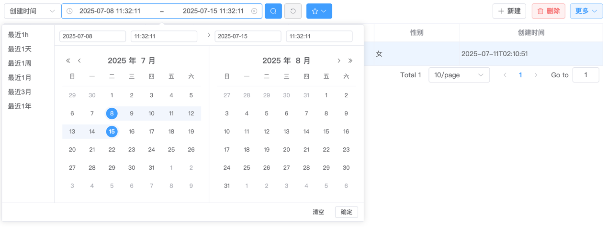
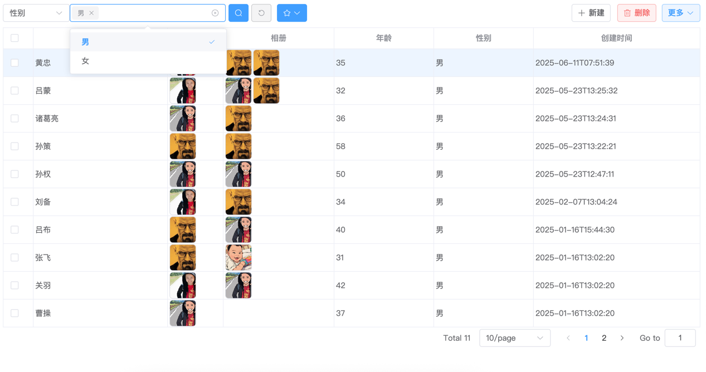
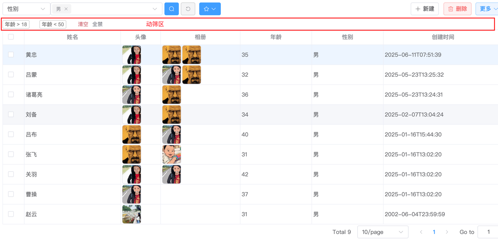

# 查询

`FastCrud`支持多种形式的复合式查询，按照呈现方式不同，我将其分为以下几种：

- 简筛
- 动筛
- 快筛
- 存筛

## 简筛

“简筛”是“简单筛选”的缩写。在页面呈现上，组件渲染区域很小很简单，所以称之为“简筛”


默认情况下，所有属性表格列，都可在简筛区的属性下拉中出现，用户可针对指定字段进行筛选过滤。

**FastCrud会自动根据列组件(`FastTableColumn*`)，渲染筛选组件。**

例如针对"创建时间"(列组件使用的是`FastTableColumnDatePicker`)， 则FastCrud会自动渲染DatePicker时间区间组件:



针对“性别”字段(列组件使用的是`FastTableColumnSelect`)，则FastCrud会自动渲染下拉组件:



其它相应列同理。

对于一些简单的数据表，“简筛”功能基本能满足需求，**还能保持页面的“美观”与“简洁“**。

:::tip
但简筛局限性很明显，考虑以下情况：

1. 当需要同时筛选【姓名】和【创建时间】区间时
2. 筛选年龄大于18且小于50的记录

简筛同时只能针对一个属性进行过滤，上述显然无法满足。这时”动筛“就能发挥其作用。
:::

## 动筛

”动筛“是”动态筛选“的缩写, 顾名思义, 筛选项是可以动态添加和删除的。通过点击表头列，激活动筛面板：


在动筛面板中，你可以针对当前字段设置排序、进行过滤筛选 以及空值查询/非空查询，此外还能查询数据库表中此字段的值(
distinct去重)。
> 还可勾选distinct值，进行in条件筛选

输入过滤条件:


点击确认:


同理, 再追加一个<50的动筛项:


如此便实现了 `18 < age < 50`的筛选目标。
:::tip

1. 鼠标移动到动筛项上, 还可以针对动筛项进行二次编辑调整，并临时启/禁用。
2. 筛选时输入框支持的语法小技巧见当前章节最后部分——筛选输入框之语法彩蛋

:::

动筛功能强大且灵活，几乎可以满足绝大多数针对单字段的筛选需求。缺点是触达路径相对较长(有时我们希望用户能少点几次)
。这时就需要快筛配合。

## 快筛

“快筛”是“快速筛选”的缩写，顾名思义，就是非常快，筛选项直接呈现出来，无需像“简筛”那样切换要筛选的字段，更无需像“动筛”那样点多次。

快筛需要开发者声明某列支持快筛，通过给列组件添加`quick-filter` 实现：

```vue

<fast-table-column prop="name" label="姓名" :quick-filter="true"/>
```

如此，FastCrud会自动在顶部直接呈现【姓名】的筛选输入项：


快筛功能跟一般常见的筛选功能交互形式相同，**其最大缺点就是当筛选字段较多时，顶部的筛选面板就占了页面极大部分**。

但有时，它仍不可或缺，尤其是当需要自定义筛选项时，例如：

1. 一个输入框，同时根据【姓名】和【介绍】等多个字段进行筛选；
2. 需要一个筛选项，跟当前列字段无关；

这时就需要开发者简单二开(具体内容详见[FastTable](/latest/comp/fast-table)章节)。

## 存筛

“存筛”是“已保存的筛选”的缩写。

有时，我们常常需要针对多个筛选项作为一个组合，这个组合有一个特定的业务含义。例如：业务上将年龄大于18岁的男同学
视为“壮丁”，业务常常需要查询所有“壮丁”，这个动作太频繁，频繁到每次要输入两个选项太麻烦，这时就可以利用“存筛”，将这两个筛选项(
包括值)归为一组， 存下来，命名为“壮丁” ，用户可直接选择“壮丁”，急速筛选出结果。

:::warning
存筛目前内置了根据创建时间的筛选(当天、当周、当月)，需要配置创建时间字段(告诉FastCrud哪个字段是创建时间字段), 具体参见[FastTable](/latest/comp/fast-table)章节。

存筛的自定义功能仍在开发中...
:::


## 文本输入框筛选之语法彩蛋

请看以下例子:

- `=曹操`： 精确匹配
- `~曹操`： 排除
- `!=曹操`：精确排除

当列组件为`FastTableColumnNumber`时，还支持:

- `>18`： 大于
- `>=18`： 大于等于
- `<50`： 小于
- `<=50`：小于等于
